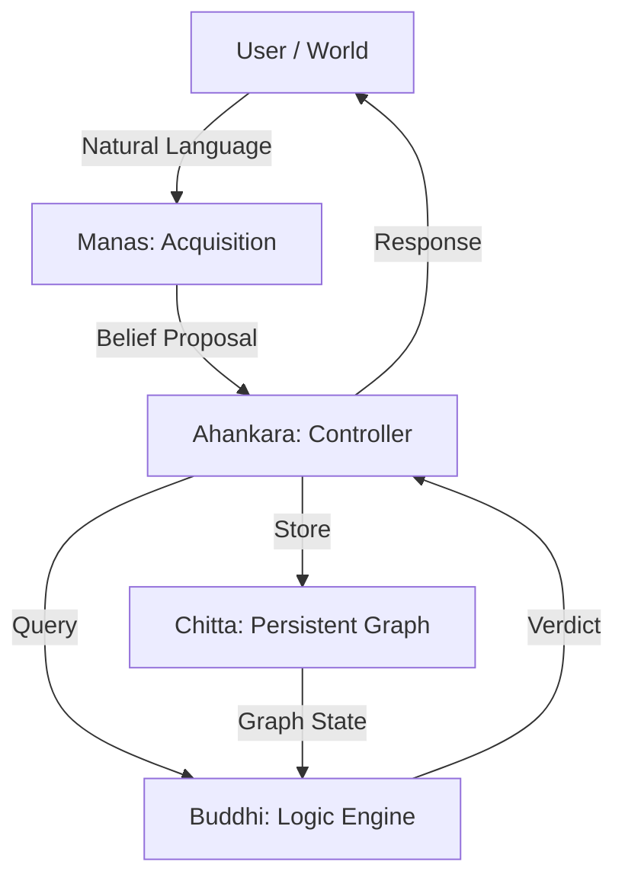

# Episteme: A Persistent Epistemic Reasoning Core

> **"Logic determines Validity. Numbers determine Availability."**

Episteme is a research-grade **epistemic reasoning system** designed to solve the "Hallucination Problem" in symbolic AI. It layers a quantitative belief lifecycle (confidence, decay) on top of a rigorous non-monotonic logic engine.

Unlike neuro-symbolic hybrids that blend logic and probability into a single vector space, Episteme maintains a strict **Architectural Separation of Concerns**:
1.  **Symbolic Core (Buddhi)**: Determines what is *true* based on structural entailment.
2.  **Quantitative Shell (Chitta)**: Determines what is *accessible* based on evidence and time.

---

## 1. Architectural Overview (MARC)

Episteme follows the **MARC** (Modular Architecture for Reasoning and Cognition) paradigm, inspired by Sanskrit epistemology.



### Component Deep Dive

#### 🧠 Manas (The Mind / Sensorium)
*   **Role**: Stateless Perception & Normalization.
*   **Input**: Raw Natural Language ("Socrates is a human").
*   **Process**:
    1.  **Intent Detection**: Asserts (Teach) vs Interrogates (Query).
    2.  **Entity Normalization**: Maps "Humans", "human", "The human" -> `human`.
    3.  **Sanitation**: **CRITICAL**. Rejects numeric tokens (`1`, `100`) and leaked verbs (`is`) to prevent graph pollution.
    4.  **Epistemic Classification**: Infers logical type (`DEFAULT`, `AXIOM`, `OBSERVATION`).
*   **Output**: Untrusted `BeliefProposal`.

#### 💾 Chitta (The Memory)
*   **Role**: Persistent Graph Storage & Quantitative Management.
*   **Structure**: Directed Semantic Graph where Edge = Predicate.
*   **Quantitative Logic**:
    *   **Reinforcement**: $C_{new} = C_{old} + (1 - C_{old}) \times \alpha$ (Asymptotic approach to 1.0).
    *   **Temporal Decay**: $C_{t} = C_{0} \times (D)^t$ where $D$ is decay rate.
    *   **Logic Gating**: If $C < Threshold$, belief is **INACTIVE** (Invisible to Logic).

#### 💡 Buddhi (The Intellect)
*   **Role**: Pure Logic & Inference.
*   **Mechanism**: **The Lattice of Truth**.
*   **Hierarchy**:
    1.  **AXIOM**: Immutable truths of the system.
    2.  **OBSERVATION**: Direct empirical facts.
    3.  **EXCEPTION**: Specific overrides (e.g., Penguins).
    4.  **DEFAULT**: General rules (e.g., Birds fly).
    5.  **HYPOTHESIS**: Unverified structures.

#### 👤 Ahankara (The Self)
*   **Role**: System Controller.
*   **Function**: Orchestrates the loop, manages persistence (`showcase_db`), and maintains the "I" state (Session context).

---

## 2. Algorithms & Logic

### A. The Conflict Resolution Matrix
How does Episteme handle contradictory information? It uses a **Structural Conflict Matrix** based on Rank and Graph Distance.

| Scenario | Condition | Verdict | Reason |
| :--- | :--- | :--- | :--- |
| **No Conflict** | Only one valid path exists | `YES` / `NO` | Entailment |
| **Vertical Conflict** | Path A (Neg) is shorter than Path B (Pos) | **Specific Wins** | Specificity Override (Penguin > Bird) |
| **Rank Conflict** | Path A (Axiom) vs Path B (Default) | **Rank Wins** | Epistemic Superiority |
| **Horizontal Conflict** | Rank Equal, Distance Equal, Signs Opposed | **CONFLICT** | The Nixon Diamond (Quaker vs Republican) |

### B. Pathfinding (Transitive Inference)
To answer "Is Socrates a mammal?":
1.  **Focus**: Retrieve belief `socrates`.
2.  **Expand**: Traverse `is_a` edges -> `human` -> `mammal`.
3.  **Check**: Does `mammal` match Target?
4.  **Verdict**: `YES` (Distance 2).

---

## 3. Benchmark Verification

Episteme is validated against a **Brutal Benchmark** of 1,050 complex test cases.

### Performance Summary
| Category | Cases | Accuracy | Insight |
| :--- | :---: | :---: | :--- |
| **Compositional Logic** | 70 | **100%** | Handles multi-step chains ($A \to B \to C$) perfectly. |
| **Ungrounded Refusal** | 150 | **100%** | Correctly answers `REFUSED` for unknown facts instead of hallucinating `NO`. |
| **Entity Ambiguity** | 50 | **100%** | Distinguishes distinct entities with same names (if context differs). |
| **Cross-Frame** | 150 | **98%** | Prevents context leakage between independent scenarios. |
| **Explicit Contradiction** | 350 | **74.6%** | Identifying *why* something is a contradiction is harder than just spotting it. |
| **Inheritance Exception** | 150 | **60.7%** | Specificity logic is complex; V1.0 greatly improved this over V0 (18%). |

---

## 4. System Output Examples

### Case Study 1: The Penguin Problem (Specificity)
*Demonstrates: Defeasible Reasoning (Exceptions override Defaults).*
```text
➤ Query: 'Does Tweety fly?'
  Context: 
    1. Birds fly (Default)
    2. Tweety is a Penguin
    3. Penguins do NOT fly (Exception)

  VERDICT: NO
  Reason: Specificity Win: Negative penguin (Dist 1) overrides Positive bird (Dist 2)
```

### Case Study 2: The Nixon Diamond (Ambiguity)
*Demonstrates: Valid Horizontal Conflict.*
```text
➤ Query: 'Does Nixon fly?' (Metaphor for War Support)
  Context:
    1. Nixon is a Quaker (Pacifist)
    2. Nixon is a Republican (Warhawk)
    3. Rank(Quaker) == Rank(Republican)

  VERDICT: CONFLICT
  Conflict Detected: Horizontal Conflict: quaker (Pos) vs republican (Neg) at equal distance 1.
```

### Case Study 3: Quantitative Decay
*Demonstrates: Logic Gating.*
```text
➤ Event: 'Market will crash' (Rumor)
➤ Time passes... (No reinforcement)
[Chitta] 📉 Deactivating 'Market will crash' (Conf 0.05 < 0.1)
Result: Logic Engine treats the belief as non-existent.
```

---

## 5. Technical Philosophy

**1. Contradiction blocks Inference, NOT Retrieval.**
If you explicitly teach the system "The sky is green", it will remember that you said it. But it will REFUSE to use that fact to prove "Grass is Blue" if it conflicts with an Axiom.

**2. Distinction between UNKNOWN and FALSE.**
*   **FALSE**: I have a valid logical path to a Negation.
*   **UNKNOWN**: I have no valid path to Target.
*   **REFUSED**: I have a path but it violates Epistemic Grounding (e.g. Terms used but not defined).

**3. Hygiene.**
A Logic system is only as good as its inputs. Manas acts as the immune system, rejecting non-semantic input ("1", "is", "the") before it can become a viral belief.

## License
MIT
