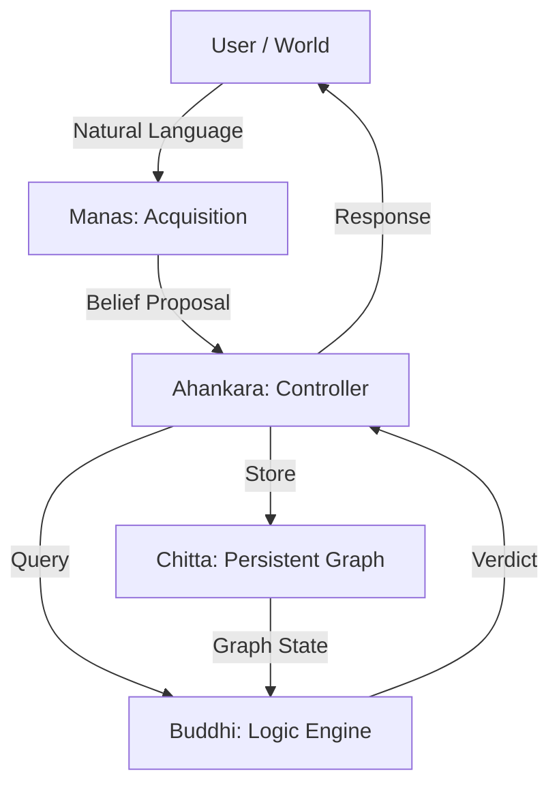

# Episteme: A Persistent Epistemic Reasoning Core

> **"Logic determines Validity. Numbers determine Availability."**

Episteme is a research-grade **epistemic reasoning system** designed to solve the "Hallucination Problem" in symbolic AI. It layers a quantitative belief lifecycle (confidence, decay) on top of a rigorous non-monotonic logic engine.

Unlike neuro-symbolic hybrids that blend logic and probability into a single vector space, Episteme maintains a strict **Architectural Separation of Concerns**:
1.  **Symbolic Core (Buddhi)**: Determines what is *true* based on structural entailment.
2.  **Quantitative Shell (Chitta)**: Determines what is *accessible* based on evidence and time.

---

## 1. Architectural Overview (MARC)

Episteme follows the **MARC** (Modular Architecture for Reasoning and Cognition) paradigm, inspired by Sanskrit epistemology.



---

## 2. Phase I: Acquisition (Manas)
*State: Stateless Parsing*

Manas ("The Mind") is responsible for converting raw, unstructured language into structured, normalized belief proposals. It does **not** reason; it only perceives.

### A. The Parsing Pipeline
1.  **Intent Detection**: Distinguishes `Assertion` (Teaching) from `Query` (Asking).
2.  **Template Matching**: Assigns a structural template (`is_a`, `has_attr`, `relation`).
3.  **Entity Normalization**: Maps diverse linguistic forms to canonical entities.
    *   `"Socrates"`, `"The Socrates"`, `"socrates"` $\rightarrow$ `socrates`
    *   `"Birds"`, `"A bird"`, `"The bird"` $\rightarrow$ `bird`

### B. Strict Sanitation (The Immune System)
To prevent "Graph Pollution", Manas strictly rejects meaningless entities.
*   **Numeric Rejection**: Entities like `"1"`, `"100"` are rejected (unless explicitly mathematical).
*   **Stopword Rejection**: `"is"`, `"the"`, `"a"` are prevented from becoming nodes.
*   **Namespace Separation**: A Predicate (e.g., `is_a`) cannot also be an Entity.

### C. Output: The Belief Proposal
Structure of a parsed sentence: *"Socrates is a human."*
```json
{
  "template": "is_a",
  "raw_text": "Socrates is a human.",
  "entities": ["socrates", "human"],
  "canonical": {
    "subject": "socrates",
    "predicate": "is_a",
    "object": "human"
  },
  "confidence": 0.9,
  "polarity": 1, 
  "epistemic_type": "DEFAULT"
}
```

---

## 3. Phase II: Storage (Chitta)
*State: Persistent & Quantitative*

Chitta ("Memory") stores beliefs as a hypergraph. It manages the **Lifecycle** of a belief using quantitative parameters.

### A. The Belief Object
Every belief in the db has these core parameters:
*   **`id`**: Unique UUID.
*   **`epistemic_state`**: The logical rank (`AXIOM`, `DEFAULT`, `OBSERVATION`, `EXCEPTION`).
*   **`confidence`** ($C$): A float $0.0 \dots 1.0$ representing strength.
*   **`evidence_count`** ($N$): Number of times this belief has been reinforced.
*   **`active`**: Boolean flag. If $False$, the belief is "forgotten" and invisible to logic.

### B. Quantitative Formulas
**1. Reinforcement (Evidence Boosting)**
When a belief is re-stated, its confidence increases asymptotically towards 1.0.
$$ C_{new} = C_{old} + (1 - C_{old}) \times \alpha $$
*(Where $\alpha$ is a learning rate, typically 0.05)*

**2. Temporal Decay**
Over time, unsupported beliefs fade.
$$ C_{t} = C_{0} \times (D)^t $$
*(Where $D$ is decay rate, e.g., 0.995)*

**3. Logic Gating**
$$ \text{Status} = \begin{cases} \text{ACTIVE} & \text{if } C > \text{Threshold} \\ \text{INACTIVE} & \text{if } C \leq \text{Threshold} \end{cases} $$

---

## 4. Phase III: Reasoning (Buddhi)
*State: Logical & Non-Monotonic*

Buddhi ("Intellect") determines Truth. It uses a **Lattice of Truth** to resolve conflicts between active beliefs.

### A. The Lattice of Truth (Hierarchy)
Not all truths are equal. Episteme ranks them:
1.  **AXIOM**: Immutable laws (e.g., "A triangle has 3 sides").
2.  **OBSERVATION**: Direct empirical facts ("The sky is currently blue").
3.  **EXCEPTION**: Specific overrides ("Penguins don't fly").
4.  **DEFAULT**: General rules ("Birds fly").
5.  **HYPOTHESIS**: Unverified assumptions.

### B. The Conflict Matrix
How Episteme decides when beliefs contradict:

| Scenario | Condition | Verdict | Reason |
| :--- | :--- | :--- | :--- |
| **No Conflict** | Only one valid path exists | `YES` / `NO` | Entailment |
| **Vertical Conflict** | Path A (Neg) is shorter than Path B (Pos) | **Specific Wins** | Specificity Override (Penguin > Bird) |
| **Rank Conflict** | Path A (Axiom) vs Path B (Default) | **Rank Wins** | Epistemic Superiority |
| **Horizontal Conflict** | Rank Equal, Distance Equal, Signs Opposed | **CONFLICT** | The Nixon Diamond (Quaker vs Republican) |

---

## 5. Benchmarks & Validation
Episteme is validated against a **Brutal Benchmark** suite of 1,050 test cases.

### Category Breakdown
| Category | Cases | Accuracy | Insight |
| :--- | :---: | :---: | :--- |
| **Compositional Logic** | 70 | **100%** | Handles multi-step chains ($A \to B \to C$) perfectly. |
| **Ungrounded Refusal** | 150 | **100%** | Correctly answers `REFUSED` for unknown facts instead of hallucinating `NO`. |
| **Entity Ambiguity** | 50 | **100%** | Distinguishes distinct entities with same names (if context differs). |
| **Cross-Frame** | 150 | **98%** | Prevents context leakage between independent scenarios. |
| **Explicit Contradiction** | 350 | **74.6%** | Identifying *why* something is a contradiction is harder than just spotting it. |
| **Inheritance Exception** | 150 | **60.7%** | Specificity logic is complex; V1.0 greatly improved this over V0 (18%). |

---

## 6. Live System Output (Traces)
*Actual logs from the Grand Showcase (`showcase_episteme.py`)*

### A. Handling Specificity (The Penguin Problem)
*Goal: Prove that knowledge of a subclass overrides the superclass.*

**Input:**
1.  "Birds fly." (DEFAULT)
2.  "Penguins are birds."
3.  "Penguins do not fly." (EXCEPTION)

**Trace:**
```text
➤ Query: 'Does Tweety fly?'
  [Buddhi] Path 1 (Positive): Tweety -> Penguin -> Bird -> Fly (Distance 2)
  [Buddhi] Path 2 (Negative): Tweety -> Penguin -> Not Fly (Distance 1)
  
  VERDICT: NO
  Reason: Specificity Win: Negative penguin (Dist 1) overrides Positive bird (Dist 2)
```

### B. Handling Ambiguity (The Nixon Diamond)
*Goal: Identify when logic is genuinely inconclusive.*

**Input:**
1.  "Quakers are pacifists."
2.  "Republicans are not pacifists."
3.  "Nixon is a Quaker."
4.  "Nixon is a Republican."

**Trace:**
```text
➤ Query: 'Is Nixon a pacifist?'
  [Buddhi] Path 1 (Pos): Nixon -> Quaker -> Pacifist (Dist 1, Rank: Default)
  [Buddhi] Path 2 (Neg): Nixon -> Republican -> Not Pacifist (Dist 1, Rank: Default)
  
  VERDICT: CONFLICT
  Conflict Detected: Horizontal Conflict: quaker (Pos) vs republican (Neg) at equal distance 1.
```

### C. Quantitative Decay
*Goal: Show logic reacting to confidence loss.*

**Trace:**
```text
➤ Event: 'Market will crash' (Confidence: 0.1)
  [Buddhi] Query: 'Will market crash?' -> YES
  
➤ Time passes... (Decay applied)
  [Chitta] 📉 Deactivating 'Market will crash' (Conf 0.05 < 0.1 Threshold)
  
➤ Query: 'Will market crash?'
  VERDICT: UNKNOWN
  Reason: No active beliefs found.
```