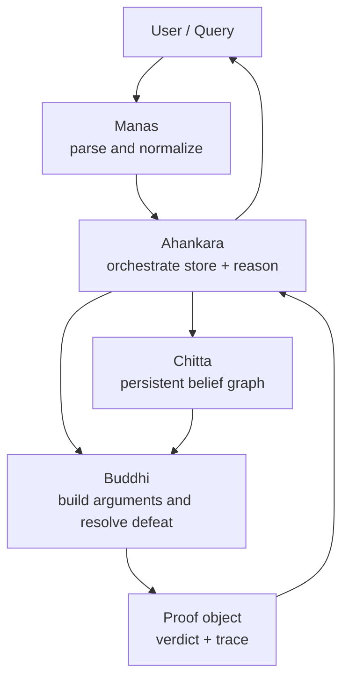
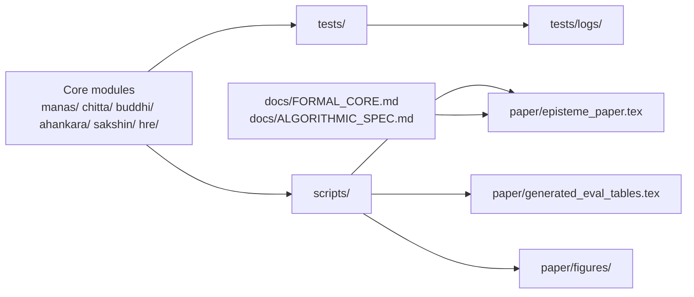

# Episteme

Episteme is a compact, proof-carrying reasoning prototype that separates parser,
memory, and defeasible reasoning into explicit layers. The repository is written
as a research codebase rather than a product demo: the goal is to keep the
architecture auditable, the formal claims bounded, and the evaluation reproducible.

## Research Boundary

Episteme is presented as:

- proof-carrying symbolic reasoning
- explicit argument traces
- defeasible conflict handling
- parser/reasoner separation
- reproducible benchmark and paper artifacts

Episteme is not presented as:

- AGI
- cognition
- universal reasoning
- a complete theory of intelligence
- unrestricted natural-language understanding

The current truth reset and open limitations are tracked in [RESEARCH_STATUS.md](RESEARCH_STATUS.md). The formal target is split across [docs/FORMAL_CORE.md](docs/FORMAL_CORE.md) and [docs/ALGORITHMIC_SPEC.md](docs/ALGORITHMIC_SPEC.md).

## Architecture

The runtime is organized as a small pipeline with a controller on top:


```mermaid
flowchart TD
    User[User / Query] --> Manas[Manas<br/>parse and normalize]
    Manas --> Ahankara[Ahankara<br/>orchestrate store + reason]
    Ahankara --> Chitta[Chitta<br/>persistent belief graph]
    Ahankara --> Buddhi[Buddhi<br/>build arguments and resolve defeat]
    Chitta --> Buddhi
    Buddhi --> Proof[Proof object<br/>verdict + trace]
    Proof --> Ahankara
    Ahankara --> User
```

The documentation and evaluation pipeline is separate from runtime execution:


```mermaid
flowchart LR
    code[Core modules<br/>manas/ chitta/ buddhi/ ahankara/ sakshin/ hre/] --> tests[tests/]
    code --> scripts[scripts/]
    scripts --> paper[paper/episteme_paper.tex]
    scripts --> tables[paper/generated_eval_tables.tex]
    scripts --> figures[paper/figures/]
    tests --> logs[tests/logs/]
    docs[docs/FORMAL_CORE.md<br/>docs/ALGORITHMIC_SPEC.md] --> paper
```

## Core Modules

| Module | Role |
| --- | --- |
| [manas/](manas/) | Parses and normalizes natural-language input into belief proposals. |
| [chitta/](chitta/) | Stores beliefs, provenance, and activation state in persistent graph form. |
| [buddhi/](buddhi/) | Constructs arguments, detects attacks, and resolves defeat. |
| [ahankara/](ahankara/) | Orchestrates parser, memory, and reasoner as a single runtime. |
| [hre/](hre/) | Hypothetical reasoning support for sandboxed what-if queries. |
| [sakshin/](sakshin/) | Observer and introspection layer for traces and monitoring. |

## Formal Documents

- [docs/FORMAL_CORE.md](docs/FORMAL_CORE.md): mathematical target for beliefs, arguments, defeat ordering, and verdict semantics.
- [docs/ALGORITHMIC_SPEC.md](docs/ALGORITHMIC_SPEC.md): algorithm sketch, complexity discussion, and known implementation gaps.
- [paper/episteme_paper.tex](paper/episteme_paper.tex): manuscript source for the paper.
- [paper/Episteme.pdf](paper/Episteme.pdf): compiled paper PDF for direct viewing.
- [RESEARCH_STATUS.md](RESEARCH_STATUS.md): current truth reset, benchmark state, and known failure modes.
- [RESEARCH_JOURNAL.md](RESEARCH_JOURNAL.md): development and experiment log.

## Repository Layout

- [main.py](main.py): CLI entry point for the prototype.
- [showcase_episteme.py](showcase_episteme.py): demo script for the high-level reasoning flow.
- [scripts/](scripts/): benchmark runners, reproduction helpers, and paper artifact generation.
- [tests/](tests/): regression tests and benchmark definitions.
- [paper/](paper/): manuscript source plus generated tables and optional figures.
- [docs/](docs/): formal and algorithmic specification drafts.

## Quick Start

Create an environment and install the Python dependencies:

```bash
python3 -m venv .venv
source .venv/bin/activate
pip install -r requirements.txt
```

Run the core test suite:

```bash
pytest -q
```

Run the showcase and the reproducibility script:

```bash
python3 showcase_episteme.py
python3 scripts/reproduce_current_results.py
```

The paper is distributed as a compiled PDF artifact; the LaTeX source is kept
for provenance and future revision.

View the current paper PDF here: [paper/Episteme.pdf](paper/Episteme.pdf).

## Generated Artifacts

Some repository outputs are generated rather than hand-maintained:

- [paper/generated_eval_tables.tex](paper/generated_eval_tables.tex)
- [paper/figures/](paper/figures/)
- [tests/logs/](tests/logs/)

These can be regenerated from the scripts in [scripts/](scripts/) and should not be edited by hand.

## Current Focus

The current workstream is deliberately narrow:

1. keep the paper grounded and reviewer-safe,
2. preserve a clear split between parsing, grounding, and reasoning,
3. use benchmark artifacts to localize failures instead of making broad claims,
4. keep the repository reproducible and easy to audit.

For the live status of benchmark results and limitations, refer to [RESEARCH_STATUS.md](RESEARCH_STATUS.md). For the formal target, refer to [docs/FORMAL_CORE.md](docs/FORMAL_CORE.md) and [docs/ALGORITHMIC_SPEC.md](docs/ALGORITHMIC_SPEC.md).
